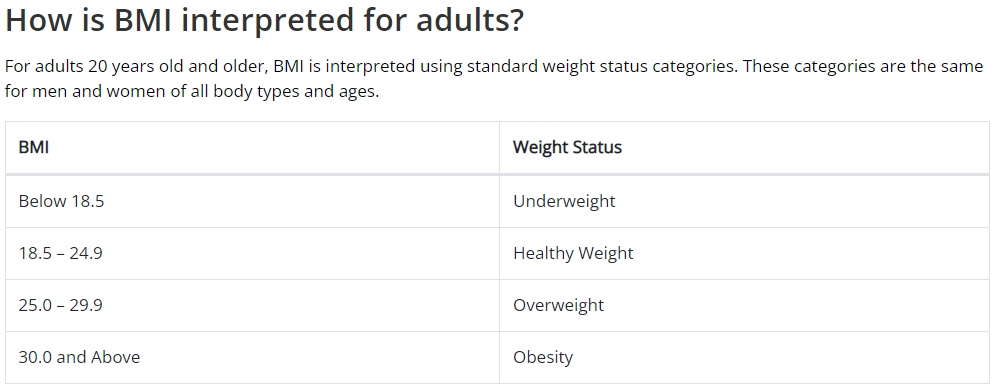

```{r setup, include=FALSE}
knitr::opts_chunk$set(echo = TRUE)
```

## Ask
### Tarea comercial
Analyze smart device usage data to gain insight into how consumers use non-Bellabeat smart devices.
After the analysis, select a Bellabeat product to apply those insights.

The insights will make it possible to recommend how to apply these trends to Bellabeat products and clients.

## Prepare
The data for the analysis was taken from Kaggle and will be downloaded to a site/folder defined by Bellabeat.
The data is organized in CSV files in comma-separated long format.
ROCCC - Reliable Original Comprehensive Current Cited
Data are Reliable, Original, Complete, Current, and Cited/Examined
The files are downloaded from the Kaggle site, in the public domain, there are 18 CSV files, the last update was 2 years ago.
The files to be analyzed are:
dailyActivity_merged.csv
sleepDay_merged.csv
weightLogInfo_merged.csv

```{r load packages}
library(tidyverse)
library(skimr)
library(janitor)
library(lubridate)
```

Read dataset CSV
```{r read csv}
df_Activity <- read.csv("dailyActivity_merged.csv")
df_Sleep <- read.csv("sleepDay_merged.csv")
df_WeightLog <- read.csv("weightLogInfo_merged.csv")
```
We explore dataset
```{r}
glimpse(df_Activity)
```

Change column ActivityDate char to date

```{r change char a date}
df_Activity$ActivityDate <- mdy(df_Activity$ActivityDate)
glimpse(df_Activity)
```
```{r}
glimpse(df_Sleep)
```
```{r}
glimpse(df_WeightLog)
```
Number of unique participants in each data frame
```{r}
n_distinct(df_Activity$Id)
n_distinct(df_Sleep$Id)
n_distinct(df_WeightLog$Id)
```

df_Activity 33 participants
df_Sleep 24 participants
df_WeightLog 8 participants

Number of observations in each data frame
```{r}
nrow(df_Activity)
nrow(df_Sleep)
nrow(df_WeightLog)
```

df_Activity 940 observations
df_Sleep 413 observations
df_WeightLog 67 observations


## Process
We have chosen R to do the whole process as it allows me to handle large files and record all stages with markdown.
To ensure data integrity, the download has been checked against the Kaggle files.

### Clean data - count total missing values in each column of data frame
```{r}
sapply(df_Activity, function(x) sum(is.na(x)))
```
```{r}
sapply(df_Sleep, function(x) sum(is.na(x)))
```
```{r}
sapply(df_WeightLog, function(x) sum(is.na(x)))
```
The column Fat have 65 values missing

### count total missing values in entire data frame
```{r}
sum(is.na(df_WeightLog))
```


## Analize
We look for insights and trends

### Three datasets
df_Activity <-  dailyActivity_merged.csv

df_Sleep <- sleepDay_merged.csv

df_WeightLog <- weightLogInfo_merged.csv


### Mean of TotalSteps, SedentaryMinutes, TotalDistance, Calories of dataframe dailyActivity
A column is created SedentaryHour

```{r}
# activity
df_Activity %>%  
  select(TotalSteps,
         SedentaryMinutes,
         TotalDistance,
         Calories) %>%
  mutate(SedentaryHour = SedentaryMinutes / 60) %>%
  summary()
```

It is observed that on average the participants are sedentary for 16.52 hours, which is an indicator that can be used in the app.


### Plot of Total Steps and Calories
```{r}
ggplot(data=df_Activity, aes(x=TotalSteps, y=Calories)) + 
  geom_point() + 
  geom_smooth() + 
  labs(title="Total Steps vs. Calories")
```

A positive correlation is observed with the greater number of steps, the greater the number of calories.

### Find sleep days
Mean of TotalMinutesAsleep, TotalTimeInBed and create three columns TotalHourSleep, TotalHoursInBed and Dif_TimeInBed_HourSleep

```{r}
df_Sleep %>%
  select(TotalMinutesAsleep, TotalTimeInBed) %>% 
  mutate(TotalHourSleep = TotalMinutesAsleep / 60) %>%
  mutate(TotalHoursInBed = TotalTimeInBed / 60) %>%
  mutate(Dif_TimeInBed_HourSleep = TotalTimeInBed-TotalMinutesAsleep) %>%
  summary()
```

On average they sleep 7 hours (6.9911) per day and spend 39.17 more minutes in bed.


### Plot df_Sleep

```{r}
ggplot(data=df_Sleep, aes(x=TotalMinutesAsleep, y=TotalTimeInBed)) +
  geom_point() + 
  geom_smooth() + 
  labs(title="Total Minutes as sleep vs. Total Time in bed")
```

### Weight Log
Mean WeightKg, WeightPounds, BMI

```{r}
df_WeightLog %>%
  select(WeightKg, WeightPounds, BMI) %>%
  summary()
```
The Mean BMI is 25.19: Overweight
It is another important indicator to work with Bellabeat products

```{r echo=FALSE, out.width = "90%", fig.align = "center"}

```


Source: Centers for Disease Control and Prevention

<https://www.cdc.gov/>

Last Reviewed: August 31, 2022


## Merging these two datasets together df_Sleep and df_Activity

```{r}
df_Sleep_Activity <- merge(df_Sleep, df_Activity, by="Id")
```

Take a look at how many participants are in this data set.

```{r}
n_distinct(df_Sleep_Activity$Id)
```

### Look Hours of Sleep and Total Steps
Mean of TotalMinutesAsleep, TotalTimeInBed and create three columns TotalHourSleep, TotalHoursInBed and Dif_TimeInBed_HourSleep

```{r}
df_Sleep_Activity %>%
  select(TotalMinutesAsleep, TotalTimeInBed, TotalSteps) %>% 
  mutate(TotalHourSleep = TotalMinutesAsleep / 60) %>%
  mutate(TotalHoursInBed = TotalTimeInBed / 60) %>%
  summary()
```
### Plot df_Sleep_Activity
Variables TotalSteps and TotalMInutesAsSleep

```{r}
ggplot(data=df_Sleep_Activity, aes(x=TotalMinutesAsleep, y=TotalSteps)) +
  geom_point() + 
  geom_smooth() + 
  labs(title="Total Minutes as sleep vs. Total Steps")
```

No trends observed for TotalMinutesAsleep and TotalSteps

## Share

Consumers use smart devices to record daily activity, hours of sleep, weight, BMI among other things.
 
Based on Activity of 940 observations, sleep 413 observations, WeightLog 67 observations.

Insights:
On average, regarding the daily activity of the participants, they have a high average of sedentary hours of 16.52 hours, there is also a positive correlation, the greater the number of steps, the greater the calories.

On average they sleep 7 hours a day and spend 39.17 more minutes in bed.

The Mean BMI is 25.19: Overweight
 
There are two insights that we can monitor through the watch and the app, they are the excess hours of sedentary lifestyle and the overweight of the BMI. If we manage to send alerts, suggestions or warnings that these two insights are elevated and the way to lower them, whether it is increasing the walks, drinking more water (Spring: This is a water bottle that tracks daily water intake using smart technology to ensure that you are appropriately hydrated throughout the day), etc., we could have a differentiating effect compared to the other devices.
 
 Audience:
Urška Sršen: Co-Founder and Creative Director of Bellabeat
Sando Mur: mathematician and co-founder of Bellabeat; key member of the Bellabeat executive team
Bellabeat Marketing Analytics Team: A team of data analysts responsible for collecting, analyzing and reporting data that helps guide Bellabeat's marketing strategy.

The best way to communicate with them is by showing the findings using data visualization.

### Presentation of the findings

High level of sedentary lifestyle and high BMI

Plot the average of hours of sedentary lifestyle for 30 days

```{r}
df_Find <- df_Activity %>%
  select(SedentaryMinutes, ActivityDate) %>%
  mutate(Day = day(ActivityDate)) %>%
  group_by(Day) %>%
  summarise(SedentaryHours = mean(SedentaryMinutes)/60)

ggplot(df_Find, aes(x=Day, y=SedentaryHours)) + 
  geom_point(size=3) +
  geom_line() +
  geom_hline(yintercept = mean(df_Find$SedentaryHours, na.rm=TRUE), color='blue', lty='dashed', linewidth=1) +
  labs(title="Sedentary Hours for day")
```

Mean of sedentary hours of 16.52 hours.


Plot the average BMI 

```{r plot BMI}
df_Find <- df_WeightLog %>%
  select(BMI) %>%
  mutate(Number=row_number())

ggplot(df_Find, aes(x=Number, y=BMI)) + 
  geom_point(size=3) +
  geom_line() +
  geom_hline(yintercept = mean(df_Find$BMI, na.rm=TRUE), color='blue', lty='dashed', linewidth=1) +
  labs(title="Mean of BMI")
```

The Mean BMI is 25.19: Overweight