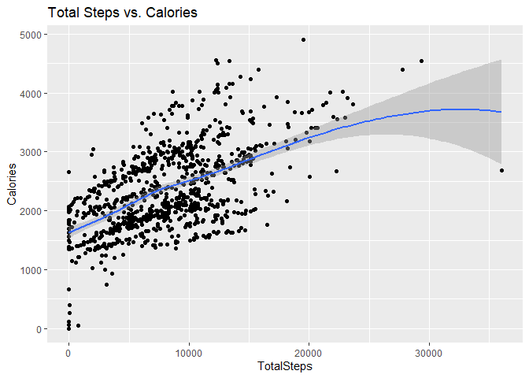
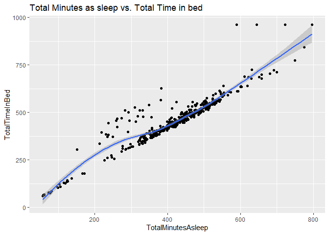
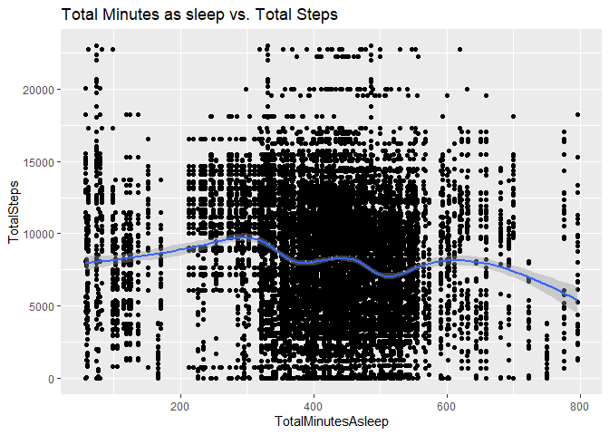
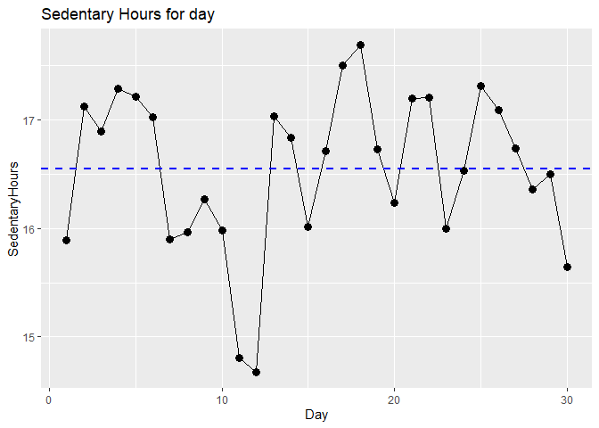

Case Study 2
================
OLP
2023-02-17

## Ask

### Tarea comercial

Analyze smart device usage data to gain insight into how consumers use
non-Bellabeat smart devices. After the analysis, select a Bellabeat
product to apply those insights.

The insights will make it possible to recommend how to apply these
trends to Bellabeat products and clients.

## Prepare

The data for the analysis was taken from Kaggle and will be downloaded
to a site/folder defined by Bellabeat. The data is organized in CSV
files in comma-separated long format. ROCCC - Reliable Original
Comprehensive Current Cited Data are Reliable, Original, Complete,
Current, and Cited/Examined The files are downloaded from the Kaggle
site, in the public domain, there are 18 CSV files, the last update was
2 years ago. The files to be analyzed are: dailyActivity_merged.csv
sleepDay_merged.csv weightLogInfo_merged.csv

``` r
library(tidyverse)
```

    ## ── Attaching packages ─────────────────────────────────────── tidyverse 1.3.2 ──
    ## ✔ ggplot2 3.4.0      ✔ purrr   0.3.5 
    ## ✔ tibble  3.1.8      ✔ dplyr   1.0.10
    ## ✔ tidyr   1.2.1      ✔ stringr 1.5.0 
    ## ✔ readr   2.1.3      ✔ forcats 0.5.2 
    ## ── Conflicts ────────────────────────────────────────── tidyverse_conflicts() ──
    ## ✖ dplyr::filter() masks stats::filter()
    ## ✖ dplyr::lag()    masks stats::lag()

``` r
library(skimr)
library(janitor)
```

    ## 
    ## Attaching package: 'janitor'
    ## 
    ## The following objects are masked from 'package:stats':
    ## 
    ##     chisq.test, fisher.test

``` r
library(lubridate)
```

    ## Loading required package: timechange
    ## 
    ## Attaching package: 'lubridate'
    ## 
    ## The following objects are masked from 'package:base':
    ## 
    ##     date, intersect, setdiff, union

Read dataset CSV

``` r
df_Activity <- read.csv("dailyActivity_merged.csv")
df_Sleep <- read.csv("sleepDay_merged.csv")
df_WeightLog <- read.csv("weightLogInfo_merged.csv")
```

We explore dataset

``` r
glimpse(df_Activity)
```

    ## Rows: 940
    ## Columns: 15
    ## $ Id                       <dbl> 1503960366, 1503960366, 1503960366, 150396036…
    ## $ ActivityDate             <chr> "4/12/2016", "4/13/2016", "4/14/2016", "4/15/…
    ## $ TotalSteps               <int> 13162, 10735, 10460, 9762, 12669, 9705, 13019…
    ## $ TotalDistance            <dbl> 8.50, 6.97, 6.74, 6.28, 8.16, 6.48, 8.59, 9.8…
    ## $ TrackerDistance          <dbl> 8.50, 6.97, 6.74, 6.28, 8.16, 6.48, 8.59, 9.8…
    ## $ LoggedActivitiesDistance <dbl> 0, 0, 0, 0, 0, 0, 0, 0, 0, 0, 0, 0, 0, 0, 0, …
    ## $ VeryActiveDistance       <dbl> 1.88, 1.57, 2.44, 2.14, 2.71, 3.19, 3.25, 3.5…
    ## $ ModeratelyActiveDistance <dbl> 0.55, 0.69, 0.40, 1.26, 0.41, 0.78, 0.64, 1.3…
    ## $ LightActiveDistance      <dbl> 6.06, 4.71, 3.91, 2.83, 5.04, 2.51, 4.71, 5.0…
    ## $ SedentaryActiveDistance  <dbl> 0, 0, 0, 0, 0, 0, 0, 0, 0, 0, 0, 0, 0, 0, 0, …
    ## $ VeryActiveMinutes        <int> 25, 21, 30, 29, 36, 38, 42, 50, 28, 19, 66, 4…
    ## $ FairlyActiveMinutes      <int> 13, 19, 11, 34, 10, 20, 16, 31, 12, 8, 27, 21…
    ## $ LightlyActiveMinutes     <int> 328, 217, 181, 209, 221, 164, 233, 264, 205, …
    ## $ SedentaryMinutes         <int> 728, 776, 1218, 726, 773, 539, 1149, 775, 818…
    ## $ Calories                 <int> 1985, 1797, 1776, 1745, 1863, 1728, 1921, 203…

Change column ActivityDate char to date

``` r
df_Activity$ActivityDate <- mdy(df_Activity$ActivityDate)
glimpse(df_Activity)
```

    ## Rows: 940
    ## Columns: 15
    ## $ Id                       <dbl> 1503960366, 1503960366, 1503960366, 150396036…
    ## $ ActivityDate             <date> 2016-04-12, 2016-04-13, 2016-04-14, 2016-04-…
    ## $ TotalSteps               <int> 13162, 10735, 10460, 9762, 12669, 9705, 13019…
    ## $ TotalDistance            <dbl> 8.50, 6.97, 6.74, 6.28, 8.16, 6.48, 8.59, 9.8…
    ## $ TrackerDistance          <dbl> 8.50, 6.97, 6.74, 6.28, 8.16, 6.48, 8.59, 9.8…
    ## $ LoggedActivitiesDistance <dbl> 0, 0, 0, 0, 0, 0, 0, 0, 0, 0, 0, 0, 0, 0, 0, …
    ## $ VeryActiveDistance       <dbl> 1.88, 1.57, 2.44, 2.14, 2.71, 3.19, 3.25, 3.5…
    ## $ ModeratelyActiveDistance <dbl> 0.55, 0.69, 0.40, 1.26, 0.41, 0.78, 0.64, 1.3…
    ## $ LightActiveDistance      <dbl> 6.06, 4.71, 3.91, 2.83, 5.04, 2.51, 4.71, 5.0…
    ## $ SedentaryActiveDistance  <dbl> 0, 0, 0, 0, 0, 0, 0, 0, 0, 0, 0, 0, 0, 0, 0, …
    ## $ VeryActiveMinutes        <int> 25, 21, 30, 29, 36, 38, 42, 50, 28, 19, 66, 4…
    ## $ FairlyActiveMinutes      <int> 13, 19, 11, 34, 10, 20, 16, 31, 12, 8, 27, 21…
    ## $ LightlyActiveMinutes     <int> 328, 217, 181, 209, 221, 164, 233, 264, 205, …
    ## $ SedentaryMinutes         <int> 728, 776, 1218, 726, 773, 539, 1149, 775, 818…
    ## $ Calories                 <int> 1985, 1797, 1776, 1745, 1863, 1728, 1921, 203…

``` r
glimpse(df_Sleep)
```

    ## Rows: 413
    ## Columns: 5
    ## $ Id                 <dbl> 1503960366, 1503960366, 1503960366, 1503960366, 150…
    ## $ SleepDay           <chr> "4/12/2016 12:00:00 AM", "4/13/2016 12:00:00 AM", "…
    ## $ TotalSleepRecords  <int> 1, 2, 1, 2, 1, 1, 1, 1, 1, 1, 1, 1, 1, 1, 1, 1, 1, …
    ## $ TotalMinutesAsleep <int> 327, 384, 412, 340, 700, 304, 360, 325, 361, 430, 2…
    ## $ TotalTimeInBed     <int> 346, 407, 442, 367, 712, 320, 377, 364, 384, 449, 3…

``` r
glimpse(df_WeightLog)
```

    ## Rows: 67
    ## Columns: 8
    ## $ Id             <dbl> 1503960366, 1503960366, 1927972279, 2873212765, 2873212…
    ## $ Date           <chr> "5/2/2016 11:59:59 PM", "5/3/2016 11:59:59 PM", "4/13/2…
    ## $ WeightKg       <dbl> 52.6, 52.6, 133.5, 56.7, 57.3, 72.4, 72.3, 69.7, 70.3, …
    ## $ WeightPounds   <dbl> 115.9631, 115.9631, 294.3171, 125.0021, 126.3249, 159.6…
    ## $ Fat            <int> 22, NA, NA, NA, NA, 25, NA, NA, NA, NA, NA, NA, NA, NA,…
    ## $ BMI            <dbl> 22.65, 22.65, 47.54, 21.45, 21.69, 27.45, 27.38, 27.25,…
    ## $ IsManualReport <chr> "True", "True", "False", "True", "True", "True", "True"…
    ## $ LogId          <dbl> 1.462234e+12, 1.462320e+12, 1.460510e+12, 1.461283e+12,…

Number of unique participants in each data frame

``` r
n_distinct(df_Activity$Id)
```

    ## [1] 33

``` r
n_distinct(df_Sleep$Id)
```

    ## [1] 24

``` r
n_distinct(df_WeightLog$Id)
```

    ## [1] 8

df_Activity 33 participants df_Sleep 24 participants df_WeightLog 8
participants

Number of observations in each data frame

``` r
nrow(df_Activity)
```

    ## [1] 940

``` r
nrow(df_Sleep)
```

    ## [1] 413

``` r
nrow(df_WeightLog)
```

    ## [1] 67

df_Activity 940 observations df_Sleep 413 observations df_WeightLog 67
observations

## Process

We have chosen R to do the whole process as it allows me to handle large
files and record all stages with markdown. To ensure data integrity, the
download has been checked against the Kaggle files.

### Clean data - count total missing values in each column of data frame

``` r
sapply(df_Activity, function(x) sum(is.na(x)))
```

    ##                       Id             ActivityDate               TotalSteps 
    ##                        0                        0                        0 
    ##            TotalDistance          TrackerDistance LoggedActivitiesDistance 
    ##                        0                        0                        0 
    ##       VeryActiveDistance ModeratelyActiveDistance      LightActiveDistance 
    ##                        0                        0                        0 
    ##  SedentaryActiveDistance        VeryActiveMinutes      FairlyActiveMinutes 
    ##                        0                        0                        0 
    ##     LightlyActiveMinutes         SedentaryMinutes                 Calories 
    ##                        0                        0                        0

``` r
sapply(df_Sleep, function(x) sum(is.na(x)))
```

    ##                 Id           SleepDay  TotalSleepRecords TotalMinutesAsleep 
    ##                  0                  0                  0                  0 
    ##     TotalTimeInBed 
    ##                  0

``` r
sapply(df_WeightLog, function(x) sum(is.na(x)))
```

    ##             Id           Date       WeightKg   WeightPounds            Fat 
    ##              0              0              0              0             65 
    ##            BMI IsManualReport          LogId 
    ##              0              0              0

The column Fat have 65 values missing

### count total missing values in entire data frame

``` r
sum(is.na(df_WeightLog))
```

    ## [1] 65

## Analize

We look for insights and trends

### Three datasets

df_Activity \<- dailyActivity_merged.csv

df_Sleep \<- sleepDay_merged.csv

df_WeightLog \<- weightLogInfo_merged.csv

### Mean of TotalSteps, SedentaryMinutes, TotalDistance, Calories of dataframe dailyActivity

A column is created SedentaryHour

``` r
# activity
df_Activity %>%  
  select(TotalSteps,
         SedentaryMinutes,
         TotalDistance,
         Calories) %>%
  mutate(SedentaryHour = SedentaryMinutes / 60) %>%
  summary()
```

    ##    TotalSteps    SedentaryMinutes TotalDistance       Calories   
    ##  Min.   :    0   Min.   :   0.0   Min.   : 0.000   Min.   :   0  
    ##  1st Qu.: 3790   1st Qu.: 729.8   1st Qu.: 2.620   1st Qu.:1828  
    ##  Median : 7406   Median :1057.5   Median : 5.245   Median :2134  
    ##  Mean   : 7638   Mean   : 991.2   Mean   : 5.490   Mean   :2304  
    ##  3rd Qu.:10727   3rd Qu.:1229.5   3rd Qu.: 7.713   3rd Qu.:2793  
    ##  Max.   :36019   Max.   :1440.0   Max.   :28.030   Max.   :4900  
    ##  SedentaryHour  
    ##  Min.   : 0.00  
    ##  1st Qu.:12.16  
    ##  Median :17.62  
    ##  Mean   :16.52  
    ##  3rd Qu.:20.49  
    ##  Max.   :24.00

It is observed that on average the participants are sedentary for 16.52
hours, which is an indicator that can be used in the app.

### Plot of Total Steps and Calories

``` r
ggplot(data=df_Activity, aes(x=TotalSteps, y=Calories)) + 
  geom_point() + 
  geom_smooth() + 
  labs(title="Total Steps vs. Calories")
```

    ## `geom_smooth()` using method = 'loess' and formula = 'y ~ x'

<!-- -->

A positive correlation is observed with the greater number of steps, the
greater the number of calories.

### Find sleep days

Mean of TotalMinutesAsleep, TotalTimeInBed and create three columns
TotalHourSleep, TotalHoursInBed and Dif_TimeInBed_HourSleep

``` r
df_Sleep %>%
  select(TotalMinutesAsleep, TotalTimeInBed) %>% 
  mutate(TotalHourSleep = TotalMinutesAsleep / 60) %>%
  mutate(TotalHoursInBed = TotalTimeInBed / 60) %>%
  mutate(Dif_TimeInBed_HourSleep = TotalTimeInBed-TotalMinutesAsleep) %>%
  summary()
```

    ##  TotalMinutesAsleep TotalTimeInBed  TotalHourSleep    TotalHoursInBed 
    ##  Min.   : 58.0      Min.   : 61.0   Min.   : 0.9667   Min.   : 1.017  
    ##  1st Qu.:361.0      1st Qu.:403.0   1st Qu.: 6.0167   1st Qu.: 6.717  
    ##  Median :433.0      Median :463.0   Median : 7.2167   Median : 7.717  
    ##  Mean   :419.5      Mean   :458.6   Mean   : 6.9911   Mean   : 7.644  
    ##  3rd Qu.:490.0      3rd Qu.:526.0   3rd Qu.: 8.1667   3rd Qu.: 8.767  
    ##  Max.   :796.0      Max.   :961.0   Max.   :13.2667   Max.   :16.017  
    ##  Dif_TimeInBed_HourSleep
    ##  Min.   :  0.00         
    ##  1st Qu.: 17.00         
    ##  Median : 25.00         
    ##  Mean   : 39.17         
    ##  3rd Qu.: 40.00         
    ##  Max.   :371.00

On average they sleep 7 hours (6.9911) per day and spend 39.17 more
minutes in bed.

### Plot df_Sleep

``` r
ggplot(data=df_Sleep, aes(x=TotalMinutesAsleep, y=TotalTimeInBed)) +
  geom_point() + 
  geom_smooth() + 
  labs(title="Total Minutes as sleep vs. Total Time in bed")
```

    ## `geom_smooth()` using method = 'loess' and formula = 'y ~ x'

<!-- -->

### Weight Log

Mean WeightKg, WeightPounds, BMI

``` r
df_WeightLog %>%
  select(WeightKg, WeightPounds, BMI) %>%
  summary()
```

    ##     WeightKg       WeightPounds        BMI       
    ##  Min.   : 52.60   Min.   :116.0   Min.   :21.45  
    ##  1st Qu.: 61.40   1st Qu.:135.4   1st Qu.:23.96  
    ##  Median : 62.50   Median :137.8   Median :24.39  
    ##  Mean   : 72.04   Mean   :158.8   Mean   :25.19  
    ##  3rd Qu.: 85.05   3rd Qu.:187.5   3rd Qu.:25.56  
    ##  Max.   :133.50   Max.   :294.3   Max.   :47.54

The Mean BMI is 25.19: Overweight It is another important indicator to
work with Bellabeat products


Source: Centers for Disease Control and Prevention

<https://www.cdc.gov/>

Last Reviewed: August 31, 2022

## Merging these two datasets together df_Sleep and df_Activity

``` r
df_Sleep_Activity <- merge(df_Sleep, df_Activity, by="Id")
```

Take a look at how many participants are in this data set.

``` r
n_distinct(df_Sleep_Activity$Id)
```

    ## [1] 24

### Look Hours of Sleep and Total Steps

Mean of TotalMinutesAsleep, TotalTimeInBed and create three columns
TotalHourSleep, TotalHoursInBed and Dif_TimeInBed_HourSleep

``` r
df_Sleep_Activity %>%
  select(TotalMinutesAsleep, TotalTimeInBed, TotalSteps) %>% 
  mutate(TotalHourSleep = TotalMinutesAsleep / 60) %>%
  mutate(TotalHoursInBed = TotalTimeInBed / 60) %>%
  summary()
```

    ##  TotalMinutesAsleep TotalTimeInBed    TotalSteps    TotalHourSleep   
    ##  Min.   : 58.0      Min.   : 61.0   Min.   :    0   Min.   : 0.9667  
    ##  1st Qu.:361.0      1st Qu.:402.0   1st Qu.: 4660   1st Qu.: 6.0167  
    ##  Median :432.0      Median :463.0   Median : 8596   Median : 7.2000  
    ##  Mean   :419.4      Mean   :458.4   Mean   : 8117   Mean   : 6.9901  
    ##  3rd Qu.:492.0      3rd Qu.:526.0   3rd Qu.:11317   3rd Qu.: 8.2000  
    ##  Max.   :796.0      Max.   :961.0   Max.   :22988   Max.   :13.2667  
    ##  TotalHoursInBed 
    ##  Min.   : 1.017  
    ##  1st Qu.: 6.700  
    ##  Median : 7.717  
    ##  Mean   : 7.639  
    ##  3rd Qu.: 8.767  
    ##  Max.   :16.017

### Plot df_Sleep_Activity

Variables TotalSteps and TotalMInutesAsSleep

``` r
ggplot(data=df_Sleep_Activity, aes(x=TotalMinutesAsleep, y=TotalSteps)) +
  geom_point() + 
  geom_smooth() + 
  labs(title="Total Minutes as sleep vs. Total Steps")
```

    ## `geom_smooth()` using method = 'gam' and formula = 'y ~ s(x, bs = "cs")'

<!-- -->

No trends observed for TotalMinutesAsleep and TotalSteps

## Share

Consumers use smart devices to record daily activity, hours of sleep,
weight, BMI among other things.

Based on Activity of 940 observations, sleep 413 observations, WeightLog
67 observations.

Insights: On average, regarding the daily activity of the participants,
they have a high average of sedentary hours of 16.52 hours, there is
also a positive correlation, the greater the number of steps, the
greater the calories.

On average they sleep 7 hours a day and spend 39.17 more minutes in bed.

The Mean BMI is 25.19: Overweight

There are two insights that we can monitor through the watch and the
app, they are the excess hours of sedentary lifestyle and the overweight
of the BMI. If we manage to send alerts, suggestions or warnings that
these two insights are elevated and the way to lower them, whether it is
increasing the walks, drinking more water (Spring: This is a water
bottle that tracks daily water intake using smart technology to ensure
that you are appropriately hydrated throughout the day), etc., we could
have a differentiating effect compared to the other devices.

Audience: Urška Sršen: Co-Founder and Creative Director of Bellabeat
Sando Mur: mathematician and co-founder of Bellabeat; key member of the
Bellabeat executive team Bellabeat Marketing Analytics Team: A team of
data analysts responsible for collecting, analyzing and reporting data
that helps guide Bellabeat’s marketing strategy.

The best way to communicate with them is by showing the findings using
data visualization.

### Presentation of the findings

High level of sedentary lifestyle and high BMI

Plot the average of hours of sedentary lifestyle for 30 days

``` r
df_Find <- df_Activity %>%
  select(SedentaryMinutes, ActivityDate) %>%
  mutate(Day = day(ActivityDate)) %>%
  group_by(Day) %>%
  summarise(SedentaryHours = mean(SedentaryMinutes)/60)

ggplot(df_Find, aes(x=Day, y=SedentaryHours)) + 
  geom_point(size=3) +
  geom_line() +
  geom_hline(yintercept = mean(df_Find$SedentaryHours, na.rm=TRUE), color='blue', lty='dashed', linewidth=1) +
  labs(title="Sedentary Hours for day")
```

<!-- -->

Mean of sedentary hours of 16.52 hours.

Plot the average BMI

``` r
df_Find <- df_WeightLog %>%
  select(BMI) %>%
  mutate(Number=row_number())

ggplot(df_Find, aes(x=Number, y=BMI)) + 
  geom_point(size=3) +
  geom_line() +
  geom_hline(yintercept = mean(df_Find$BMI, na.rm=TRUE), color='blue', lty='dashed', linewidth=1) +
  labs(title="Mean of BMI")
```

<!-- -->

The Mean BMI is 25.19: Overweight
